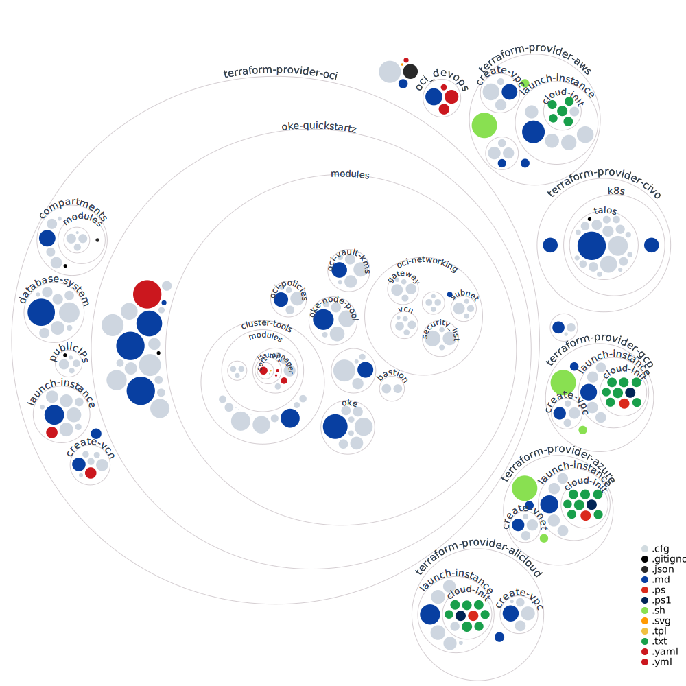

# terraform-examples
This repository is aimed to gather labs from different terraform providers to start learning . The terraform for dummies series will include but are not limited to resource deployments for providers like: 
- [Azure](https://github.com/brokedba/terraform-examples/tree/master/terraform-provider-azure)
- [AWS](https://github.com/brokedba/terraform-examples/tree/master/terraform-provider-aws)
- [OCI](https://github.com/brokedba/terraform-examples/tree/master/terraform-provider-oci)
- [GCP](https://github.com/brokedba/terraform-examples/tree/master/terraform-provider-gcp)
- [AliBabaCloud](https://github.com/brokedba/terraform-examples/tree/master/terraform-provider-alicloud)
- [Libvirt (for KVM On-prem )](https://github.com/brokedba/terraform-examples/tree/master/terraform-provider-libvirt)

Please visit my recap blog post for more information

http://www.brokedba.com/2021/12/my-terraform-labs-2021-cloud-recap.html
# Variables 
Some variables used to deploy the steps have default values, check those before deployment to ensure they match your requirements. For more information, there are tables of inputs and outputs for the Terraform configs, each with a detailed description of their variables. Look for variables marked as not required in the section Inputs of these READMEs:
# Recently added Cloud stack
- [ALIBABA CLOUD ](/terraform-provider-alicloud)
# 🎦 Repository Visualization
 
